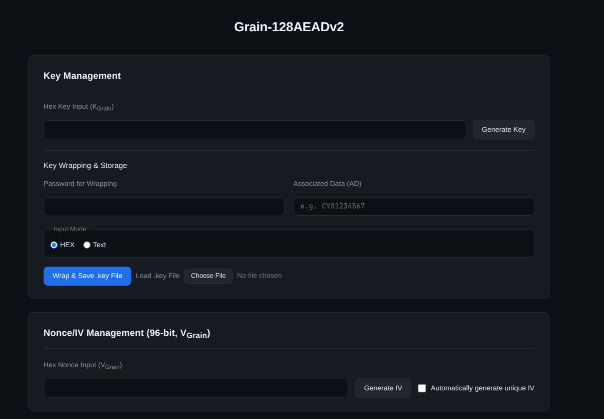
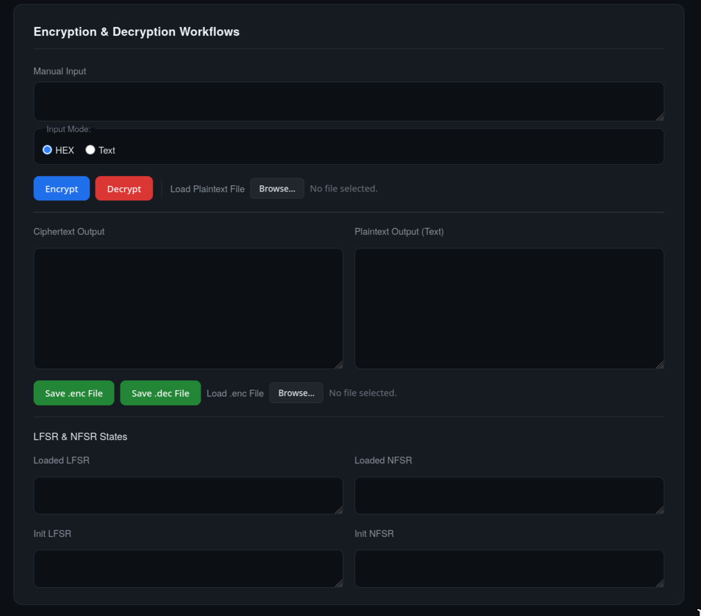
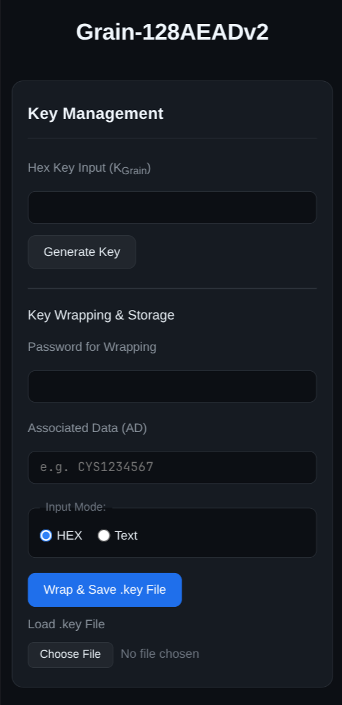
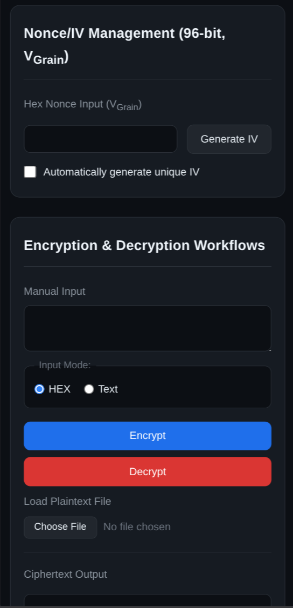

# Grain-128AEADv2 Go

This repository implements [`Grain-128AEADv2`](https://grain-128aead.github.io/) using [`Go`](https://go.dev/), and develops a frontend using [`TypeScript`](https://www.typescriptlang.org/).

## Screenshot

<p align="center">
  <b>Desktop</b><br>
  &nbsp;&nbsp;&nbsp;
  
</p>

<p align="center">
  <b>Mobile</b><br>
  &nbsp;&nbsp;&nbsp;
  
</p>

## Table of Contents

<!-- toc -->

- [Features](#features)
- [Usage](#usage)
- [Development](#development)
  - [Requirements](#requirements)
  - [Project Structure](#project-structure)
  - [Commands](#commands)
- [License](#license)
- [Acknowledgement](#acknowledgement)

<!-- tocstop -->

## Features

- Key management
  - Key generation
  - Key wrapping, unwrapping, and authentication using `PBKDF2-HMAC-SHA256` and `AES-128-CCM`
  - Store wrapped `.key` file in Hex format
- Nonce/IV management
  - Random nonce/IV generation
  - Automatically unique nonce/IV generation
- Encryption & Decryption
  - Encrypt and decrypt given input using `Grain-128AEADv2`
  - Load plaintext from a file
  - Output loaded states and initial states of both LFSR and NFSR
  - Output ciphertext in the format of `IV` + `Ciphertext`
  - Store ciphertext into a `.enc` file
  - Store plaintext into a `.dec` file

## Usage

1. Download pre-built binaries from [`GitHub Release`](https://github.com/fovir-github/grain-128aeadv2-go/releases/latest) according the platform and architecture.
2. Run the program, and it will output logs in a terminal and open the browser automatically. If the browser is not automatically launched, the corresponding address can be found in the terminal as well.
3. To quit the program, close the browser tab and press `Ctrl + c` in the terminal.

## Development

### Requirements

- `Go` >= `1.26.3`
- [`esbuild`](https://esbuild.github.io/) (Optional if frontend is not modified)
- [`tygo`](https://github.com/gzuidhof/tygo) (Optional if files under `internal/model/` are not changed)

### Project Structure

```text
.
├── frontend
│   ├── js/ <- JavaScript compiled from `src/` folder using `esbuild`
│   ├── src
│   │   ├── features/ <- Key management, nonce management, and cipher operation
│   │   ├── lib/ <- API, elements, DOM operation, etc.
│   │   ├── styles/ <- Style sheet
│   │   ├── types/ <- Schema generated from `internal/model/` using `tygo`
│   │   └── main.ts <- Entrypoint of the frontend
│   └── index.html
├── internal <- Backend packages
│   ├── grain/ <- Implementation of Grain-128AEADv2
│   ├── handler/ <- HTTP handlers
│   ├── keys/ <- Key management
│   ├── model/ <- Request and response models
│   ├── service/ <- Encryption, decryption, etc.
│   └── utils/ <- Tool functions
├── .envrc
├── .gitignore
├── .prettierrc
├── flake.lock
├── flake.nix
├── go.mod
├── go.sum
├── justfile
├── LICENSE
├── main.go <- Entrypoint of backend
├── README.md
├── tsconfig.json <- TypeScript configuration
└── tygo.yaml <- tygo configuration
```

### Commands

- Run the program:

  ```bash
  go run main.go
  ```

- Compile TypeScript:

  ```bash
  esbuild ./frontend/src/main.ts --bundle --minify --outfile=./frontend/js/index.min.js
  ```

- Run `tygo`:

  ```bash
  tygo generate
  ```

- Testing:

  ```bash
  go test ./...
  ```

## License

Apache-2.0 license

## Acknowledgement

- [`pion/dtls`](https://github.com/pion/dtls/): Implement the `AES-128-CCM` algorithm
- [`gzuidhof/tygo`](https://github.com/gzuidhof/tygo): Generate Typescript types from Golang source code
